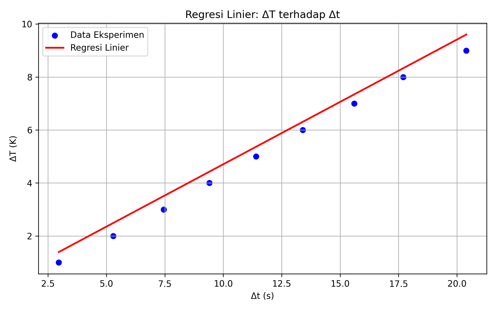

# Pengujian Konstanta Daya Hantar Panas Gabus Menggunakan Regresi Linier Least-Square

Konstanta daya hantar panas, dengan satuan W/(m.K) (Watt per meter-kelvin) merupakan besaran kemampuan suatu zat untuk menghantarkan panas. Laporan ini menguji daya hantar panas zat gabus berdasarkan pengukuran waktu terhadap perubahan temperatur. Melalui metode numerik interpolasi linier regresi least square, laporan ini menghitung hubungan dua buah variabel percobaan tersebut serta beberapa konstan hasil ukur untuk menguji konstanta daya hantar panas gabus terhadap data literatur yang ada.

## Cara Menjalankan

### 1. Input data perubahan Temperatur terhadap Waktu dalam dataset.csv
```
T,t
1.0,2.96
2.0,5.29
3.0,7.45
4.0,9.40
5.0,11.40
...
```

### 2. Compile dan run program C untuk regresi

```bash
gcc -o regression main.c -lm
./regression
```

Output:

* Nilai kemiringan regresi `b` (dT/dt)
* Nilai daya hantar panas `k`
* File `regression_plot.csv`

### 3. Plot Menggunakan Python

Install dependency yang diperlukan

```bash
pip install pandas matplotlib
```
Jalankan plot
```bash
python plot.py
```

Hasil plot juga akan disimpan sebagai `regresi_plot.png`.

## Penjelasan Kode

* **Regresi Linier** menggunakan metode regresi linier least square:

  $$
  b = \frac{n\sum(xy) - \sum x \sum y}{n\sum x^2 - (\sum x)^2}
  $$
* Nilai `b` digunakan untuk menghitung konduktivitas termal `k` dengan rumus:

  $$
  k = \frac{mcx}{A(T_2 - T_1)} \cdot b
  $$

  dengan:

  * m = 4.3e-3 kg
  * x = 3.8e-3 m
  * A = 7.76e-3 m²
  * c = 900 J/kg·K
  * T₁ = 26.2 =°C, T₂ = 49.6 °C

Dengan ini, program pertama-tama membaca isi dari `dataset.csv` menggunakan 
```c
FILE *input = fopen("dataset.csv", "r");
if (input == NULL) {
    printf("Error: Cannot open dataset.csv\n");
    return 1;
}
int count = fileLineCount(input);

double *x = malloc(sizeof(double) * count);
double *y = malloc(sizeof(double) * count); 

char header[100];
fgets(header, sizeof(header), input);
for (int i = 0; i < count; i++)     {
    if (fscanf(input, "%lf,%lf", &y[i], &x[i]) != 2) {
        printf("Error reading dataset %d\n", i);
        continue;
    }
}
```
setiap input dari csv disimpan dalam heap memory yang diatur menggunakan `malloc()`. Fungsi `fileLineCount()` menghitung jumlah line dalam sebuah file untuk dataset dinamis.

Setelah data dibaca, regresi linier dilakukan dengan fungsi 
```c
double b = regressionSlope(x, y, count);
```
yang berupa 
```c
double regressionSlope(double x[], double y[], int n) {
    double sum_x = 0.0, sum_y = 0.0, sum_xy = 0.0, sum_xx = 0.0;

    // Sum setiap variabel untuk regresi
    for (int i = 0; i < n; i++) {
        sum_x += x[i];
        sum_y += y[i];
        sum_xy += x[i] * y[i];
        sum_xx += x[i] * x[i];
    }

    // Slope regresi least square
    return (n * sum_xy - sum_x * sum_y) / (n * sum_xx - (sum_x * sum_x));
}
```
Fungsi tersebut menggunakan for loop untuk melakukan sumasi dari setiap value x, y, x^2, y^2, dan xy. Fungsi lalu mengembalikan kemiringan berdasarkan formula regresi linier least square.

Berdasarkan kemiringan tersebut, daya hantar panas dihitung bersama beberapa konstanta percobaan dengan 
```c
double calculateConductivity(double b) {
    // Konstanta eksperimen
    static const double m = 4.3e-3, x = 3.8e-3, A = 7.76e-3, c = 900, T1 = 26.2, T2 = 49.6;

    return (m * c * x) / (A * (T2 - T1)) * b;
}
```

Terakhir, data kemiringan tersebut digabungkan sebagai sebuah grafis kemiringan bersama dengan plot data yang ada.

```c
// Plot to CSV for python matplotlib script
double plotCSV(FILE *input, double x[], double y[], double b, int count) {
    FILE *pout = fopen("regression_plot.csv", "w");

    char header[100];
    rewind(input);
    fgets(header, sizeof(header), input);

    fprintf(pout, "dt,dT,y_fit\n");
    for (int i = 0; i < count; i++) {
        double dt = x[i], dT = y[i];
        double y_fit = b * dt; // y fit buat aproksimasi berdasarkan regresi
        fprintf(pout, "%lf,%lf,%lf\n", dt, dT, y_fit);
    }
    fclose(pout);
}
```
Program memberikan y fit aproksimasi dengan
$$
y=bx
$$

Sehingga sebuah program python matplotlib menghasilkan sebuah grafis berdasarkan data csv tersebut.
```py
import pandas as pd
import matplotlib.pyplot as plt

df = pd.read_csv("regression_plot.csv")

df = df.dropna()
df = df[pd.to_numeric(df['dt'], errors='coerce').notnull()]
df = df[pd.to_numeric(df['dT'], errors='coerce').notnull()]
df = df[pd.to_numeric(df['y_fit'], errors='coerce').notnull()]

df['dt'] = pd.to_numeric(df['dt'])
df['dT'] = pd.to_numeric(df['dT'])
df['y_fit'] = pd.to_numeric(df['y_fit'])

# Plot
plt.figure(figsize=(8, 5))
plt.scatter(df['dt'], df['dT'], label='Data Eksperimen', color='blue')
plt.plot(df['dt'], df['y_fit'], label='Regresi Linier', color='red', linewidth=2)

plt.title("Regresi Linier: ΔT terhadap Δt")
plt.xlabel("Δt (s)")
plt.ylabel("ΔT (K)")
plt.grid(True)
plt.legend()
plt.tight_layout()
plt.savefig("regresi_plot.png", dpi=300)
plt.show()
```

